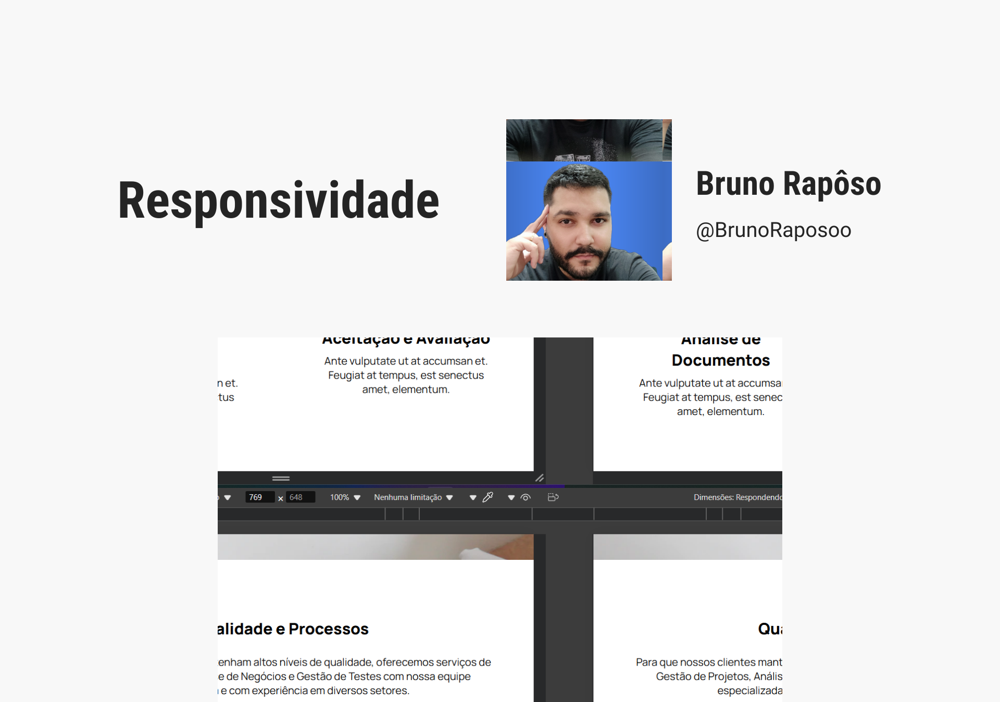

<h1 align="center"> responsividade  </h1>

  <a href="#-tecnologias">Tecnologias</a>&nbsp;&nbsp;&nbsp;|&nbsp;&nbsp;&nbsp;
  <a href="#-projeto">Projeto</a>&nbsp;&nbsp;&nbsp;|&nbsp;&nbsp;&nbsp;
  <a href="#-layout">Layout</a>&nbsp;&nbsp;&nbsp

 

  

## 🚀 Tecnologias

Esse projeto foi desenvolvido com as seguintes tecnologias:

- [HTML](https://html.com/)
- [CSS](https://www.w3.org/Style/CSS/Overview.en.html)

## 💻 Projeto

Projeto desenvolvido para criar uma página landing page e aplicar responsividade para tablets e dispositivos móveis.    
Para acessar o projeto clique [AQUI]()

## 🔖 Layout

Você pode visualizar o layout do projeto através [DESSE LINK](https://www.figma.com/design/XvZZxpl5zKnMCqGR5PUedf/Landing-Page-UI---Responsividade-com-CSS-(DNC)?node-id=0-1&node-type=canvas&t=JxNImotJfTb8nT6X-0). É necessário ter conta no [Figma](https://figma.com) para acessá-lo.